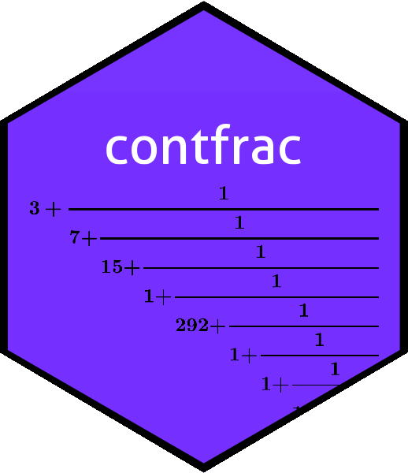

Continued fractions in R
================

<!-- README.md is generated from README.Rmd. Please edit that file -->



<!-- badges: start -->

[](https://travis-ci.org/RobinHankin/contfrac)
[](https://cran.r-project.org/package=contfrac)
[](http://www.rdocumentation.org/packages/contfrac)
<!-- badges: end -->

# Continued fractions

A continued fraction is an expression of the form


Such expressions are interesting and useful in a number of mathematical
applications. A *generalized* continued fraction is an expression of the
form


The contfrac package provides functionality to deal with both these.

## Installation

To install the most recent stable version on CRAN, use
`install.packages()` at the R prompt:

`R> install.packages("contfrac")`

And then to load the package use `library()`:

``` r
library("contfrac")
```

## Package features

The package provides functionality for dealing with continued fractions.

``` r
as_cf(pi,n=7)   # convert pi to continued fraction form
#> [1]   3   7  15   1 292   1   1
```

We can evaluate convergents of any sequence using `convergents()` or
`nconv()`:

``` r
convergents(1:8)
#> $A
#> [1]     1     3    10    43   225  1393  9976 81201
#> 
#> $B
#> [1]     1     2     7    30   157   972  6961 56660
nconv(1:8)
#> [1] 1.433127
```

The package uses standard IEEE arithmetic so is not reliable past a
certain point, shown here by expanding the golden ratio:

``` r
as_cf((1+sqrt(5))/2,n=50)
#>  [1] 1 1 1 1 1 1 1 1 1 1 1 1 1 1 1 1 1 1 1 1 1 1 1 1 1 1 1 1 1 1 1 1 1 1 1 1 1 1
#> [39] 2 2 1 8 2 2 2 3 2 1 2 3
```

## Further information

For more details, and some discussion of the mathematics of continued
fractions, see the package vignette.
